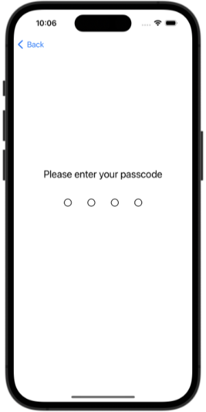
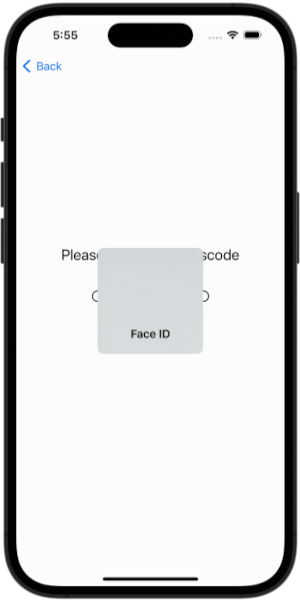

<!--

This source file is part of the Stanford Spezi open-source project.

SPDX-FileCopyrightText: 2022 Stanford University and the project authors (see CONTRIBUTORS.md)

SPDX-License-Identifier: MIT

-->

# Spezi Access Guard


Enforce code or biometrics-guarded access to SwiftUI views.

|<picture><source media="(prefers-color-scheme: dark)" srcset="SpeziAccessGuard.docc/Resources/AccessGuarded-dark.png"></picture>|<picture><source media="(prefers-color-scheme: dark)" srcset="SpeziAccessGuard.docc/Resources/AccessGuarded-Biometrics-dark.png"></picture>|
|:--:|:--:|
|4-digit Numeric Access Code|Face ID with Access Code Fallback|

## Overview

Enforce code or biometrics-guarded access to SwiftUI views.

For more information, please refer to the [API documentation](SpeziAccessGuard.docc/SpeziAccessGuard.md).

### Setup

Add the Spezi monorepo package to your app and select the `SpeziAccessGuard` product.

In Xcode, select **File > Add Package Dependencies...**, enter:

```text
https://github.com/SchmiedmayerLab/Spezi.git
```

Choose **Up to Next Minor Version** and enter the latest tagged `0.x` release, for example `0.1.0`.

If you manage dependencies in a `Package.swift`, add the package dependency:

```swift
.package(url: "https://github.com/SchmiedmayerLab/Spezi.git", .upToNextMinor(from: "0.1.0"))
```

Then add the product dependency to the target that needs it:

```swift
.target(
    name: "MyApp",
    dependencies: [
        .product(name: "SpeziAccessGuard", package: "Spezi")
    ]
)
```

> [!IMPORTANT]
> If your application is not yet configured to use Spezi, follow the [Spezi setup article](../Spezi/Spezi.docc/Initial%20Setup.md) to set up the core Spezi infrastructure.

## Usage

You use the ``AccessGuards`` module to define your app's access guards, as part of the overall Spezi configuration:
```swift
import Spezi
import SpeziAccessGuard

class ExampleDelegate: SpeziAppDelegate {
    override var configuration: Configuration {
        Configuration {
            AccessGuards {
                CodeAccessGuard(.transactions)
                BiometricAccessGuard(.accountInfo)
                CodeAccessGuard(.hiddenFeature, fixed: "7184")
            }
        }
    }
}

extension AccessGuardIdentifier where AccessGuard == CodeAccessGuard {
    static let transactions: Self = .passcode("com.myApp.transactions")
    static let hiddenFeature: Self = .passcode("com.myApp.hiddenFeature")
}

extension AccessGuardIdentifier where AccessGuard == BiometricAccessGuard {
    static let accountInfo: Self = .passcode("com.myApp.accountInfo")
}
```

You then can use these Access Guards in your app, e.g. via the ``AccessGuarded`` view, which automatically manages the presentation and unlocking of the access guard for you:
```swift
var body: some View {
    TabView {
        // ...
        Tab("Account", systemImage: "person.circle") {
            AccessGuarded(.accountInfo) {
                AccountTab()
            }
        }
    }
}
```

For more information, please refer to the [API documentation](SpeziAccessGuard.docc/SpeziAccessGuard.md).


## Contributing

Contributions to this project are welcome. Please make sure to read the [contribution guide](../Spezi/Spezi.docc/Contributing%20Guide.md) and the [Contributor Covenant Code of Conduct](https://github.com/SchmiedmayerLab/.github/blob/main/CODE_OF_CONDUCT.md) first.

## License

This target is licensed under the MIT License. The local [LICENSES](LICENSES) directory records license information imported from the original upstream repository. See the monorepo [LICENSES](../../LICENSES) directory for license information covering current changes in this repository.


## Contributors

The local [CONTRIBUTORS.md](CONTRIBUTORS.md) file records contributors from the original upstream repository. See the monorepo [CONTRIBUTORS.md](../../CONTRIBUTORS.md) file for contributors to current changes in this repository.
