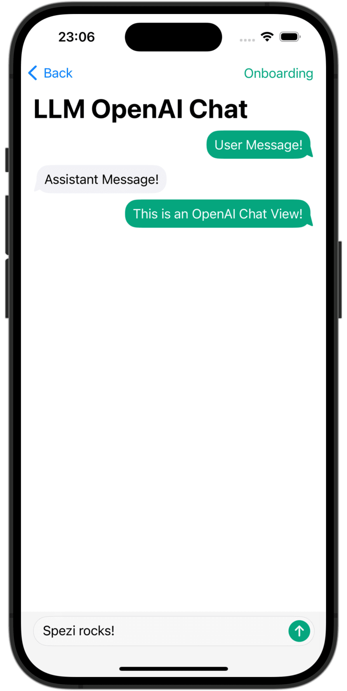
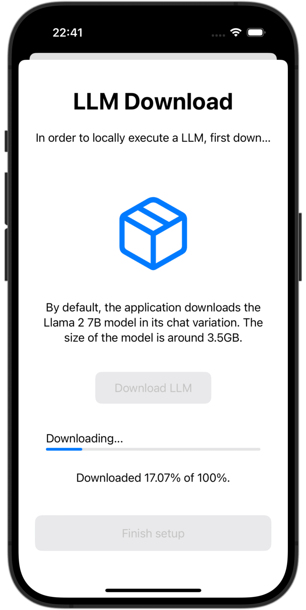
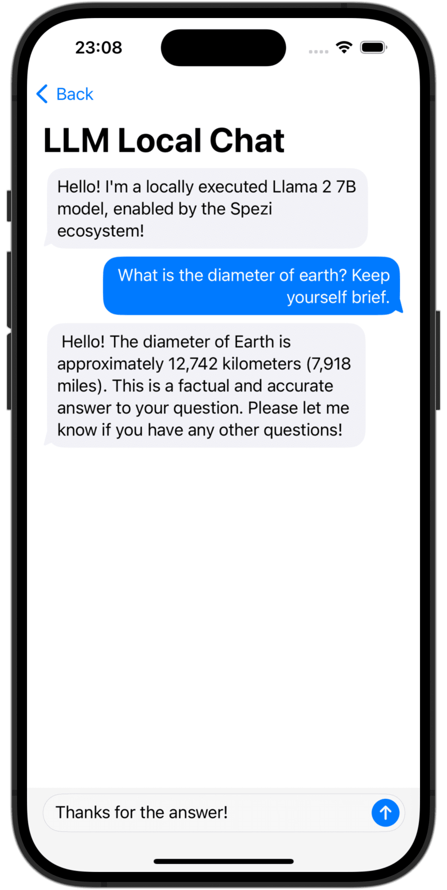

<!--

This source file is part of the Stanford Spezi open source project

SPDX-FileCopyrightText: 2023 Stanford University and the project authors (see CONTRIBUTORS.md)

SPDX-License-Identifier: MIT

-->

# Spezi LLM


## Overview

The Spezi LLM Swift Package includes modules that are helpful to integrate LLM-related functionality in your application.
The package provides all necessary tools for local LLM execution, the usage of remote OpenAI-based LLMs, as well as LLMs running on Fog node resources within the local network.

|<picture><source media="(prefers-color-scheme: dark)" srcset="../SpeziLLMOpenAI/SpeziLLMOpenAI.docc/Resources/ChatView~dark.png"></picture>|<picture><source media="(prefers-color-scheme: dark)" srcset="../SpeziLLMLocalDownload/SpeziLLMLocalDownload.docc/Resources/LLMLocalDownload~dark.png"></picture>|<picture><source media="(prefers-color-scheme: dark)" srcset="../SpeziLLMLocal/SpeziLLMLocal.docc/Resources/ChatView~dark.png"></picture>|
|:--:|:--:|:--:|
|`OpenAI LLM Chat View`|`Language Model Download`|`Local LLM Chat View`|

## Setup

### 1. Add Spezi LLM as a Dependency

Add the Spezi monorepo package to your app and select the products you need, such as `SpeziLLM`, `SpeziLLMLocal`, `SpeziLLMLocalDownload`, `SpeziLLMOpenAI`, `SpeziLLMFog`, `SpeziLLMOpenAIRealtime`, `SpeziLLMAnthropic`, or `SpeziLLMGemini`.

In Xcode, select **File > Add Package Dependencies...**, enter:

```text
https://github.com/SchmiedmayerLab/Spezi.git
```

Choose **Up to Next Minor Version** and enter the latest tagged `0.x` release, for example `0.1.0`.

If you manage dependencies in a `Package.swift`, add the package dependency:

```swift
.package(url: "https://github.com/SchmiedmayerLab/Spezi.git", .upToNextMinor(from: "0.1.0"))
```

Then add the product dependency to the target that needs it:

```swift
.target(
    name: "MyApp",
    dependencies: [
        .product(name: "SpeziLLM", package: "Spezi"),
        .product(name: "SpeziLLMLocal", package: "Spezi"),
        .product(name: "SpeziLLMLocalDownload", package: "Spezi"),
        .product(name: "SpeziLLMOpenAI", package: "Spezi"),
        .product(name: "SpeziLLMFog", package: "Spezi"),
        // Add other Spezi products from this package as needed.
    ]
)
```

> [!IMPORTANT]
> If your application is not yet configured to use Spezi, follow the [Spezi setup article](../Spezi/Spezi.docc/Initial%20Setup.md) to set up the core Spezi infrastructure.

### 2. Follow the setup steps of the individual targets

As Spezi LLM contains a variety of different targets for specific LLM functionalities, please follow the additional setup guide in the respective target section of this README.

## Targets

Spezi LLM provides a number of targets to help developers integrate LLMs in their Spezi-based applications:
- [SpeziLLM](SpeziLLM.docc/SpeziLLM.md): Base infrastructure of LLM execution in the Spezi ecosystem.
- [SpeziLLMLocal](../SpeziLLMLocal/SpeziLLMLocal.docc/SpeziLLMLocal.md): Local LLM execution capabilities directly on-device. Enables running open-source LLMs from Hugging Face like [Meta's Llama2](https://ai.meta.com/llama/), [Microsoft's Phi](https://azure.microsoft.com/en-us/products/phi), [Google's Gemma](https://ai.google.dev/gemma), or [DeepSeek-R1](https://huggingface.co/deepseek-ai/DeepSeek-R1), among others. See LLMLocalModel for a list of models tested with SpeziLLM.
- [SpeziLLMLocalDownload](../SpeziLLMLocalDownload/SpeziLLMLocalDownload.docc/SpeziLLMLocalDownload.md): Download and storage manager of local Language Models, including onboarding views.
- [SpeziLLMOpenAI](../SpeziLLMOpenAI/SpeziLLMOpenAI.docc/SpeziLLMOpenAI.md): Integration with OpenAI's GPT models via using OpenAI's API service.
- [SpeziLLMFog](../SpeziLLMFog/SpeziLLMFog.docc/SpeziLLMFog.md): Discover and dispatch LLM inference jobs to Fog node resources within the local network.

The section below highlights the setup and basic use of the SpeziLLMLocal, SpeziLLMOpenAI, and SpeziLLMFog targets in order to integrate Language Models in a Spezi-based application.

> [!NOTE]
> To learn more about the usage of the individual targets, please refer to the [SpeziLLM](SpeziLLM.docc/SpeziLLM.md), [SpeziLLMLocal](../SpeziLLMLocal/SpeziLLMLocal.docc/SpeziLLMLocal.md), [SpeziLLMLocalDownload](../SpeziLLMLocalDownload/SpeziLLMLocalDownload.docc/SpeziLLMLocalDownload.md), [SpeziLLMOpenAI](../SpeziLLMOpenAI/SpeziLLMOpenAI.docc/SpeziLLMOpenAI.md), and [SpeziLLMFog](../SpeziLLMFog/SpeziLLMFog.docc/SpeziLLMFog.md) documentation.

### Spezi LLM Local

The target enables developers to easily execute medium-size Language Models (LLMs) locally on-device. The module allows you to interact with the locally run LLM via purely Swift-based APIs, no interaction with low-level code is necessary, building on top of the infrastructure of the [SpeziLLM](SpeziLLM.docc/SpeziLLM.md) target.

> [!IMPORTANT]
> Spezi LLM Local is not compatible with simulators. The underlying [`mlx-swift`](https://github.com/ml-explore/mlx-swift) requires a modern Metal MTLGPUFamily and the simulator does not provide that.

> [!IMPORTANT]
> To use the LLM local target, some LLMs require adding the *Increase Memory Limit* entitlement to the project.

#### Setup

You can configure the Spezi Local LLM execution within the typical `SpeziAppDelegate`.
In the example below, the `LLMRunner` from the SpeziLLM target which is responsible for providing LLM functionality within the Spezi ecosystem is configured with the `LLMLocalPlatform` from the SpeziLLMLocal target. This prepares the `LLMRunner` to locally execute Language Models.

```swift
class TestAppDelegate: SpeziAppDelegate {
    override var configuration: Configuration {
        Configuration {
            LLMRunner {
                LLMLocalPlatform()
            }
        }
    }
}
```

[SpeziLLMLocalDownload](../SpeziLLMLocalDownload/SpeziLLMLocalDownload.docc/SpeziLLMLocalDownload.md) can be used to download an LLM from [HuggingFace](https://huggingface.co/) and save it on the device for execution. The `LLMLocalDownloadView` provides an out-of-the-box onboarding view for downloading models locally.

```swift
struct LLMLocalOnboardingDownloadView: View {
    var body: some View {
        LLMLocalDownloadView(
            model: .llama3_8B_4bit,
            downloadDescription: "The Llama3 8B model will be downloaded",
        ) {
            // Action to perform after the model is downloaded and the user presses the next button.
        }
    }
}
```

> [!TIP]
> The `LLMLocalDownloadView` view can be included in your onboarding process using [SpeziOnboarding](../SpeziOnboarding/SpeziOnboarding.docc/SpeziOnboarding.md) as demonstrated in this example.


#### Usage

The code example below showcases the interaction with local LLMs through the the SpeziLLM `LLMRunner`, which is injected into the SwiftUI `Environment` via the `Configuration` shown above.

The `LLMLocalSchema` defines the type and configurations of the to-be-executed `LLMLocalSession`. This transformation is done via the `LLMRunner` that uses the `LLMLocalPlatform`. The inference via `LLMLocalSession/generate()` returns an `AsyncThrowingStream` that yields all generated `String` pieces.

```swift
struct LLMLocalDemoView: View {
    @Environment(LLMRunner.self) var runner
    @State var responseText = ""

    var body: some View {
        Text(responseText)
            .task {
                // Instantiate the `LLMLocalSchema` to an `LLMLocalSession` via the `LLMRunner`.
                let llmSession: LLMLocalSession = runner(
                    with: LLMLocalSchema(
                        model: .llama3_8B_4bit,
                    )
                )

                do {
                    for try await token in try await llmSession.generate() {
                        responseText.append(token)
                    }
                } catch {
                    // Handle errors here. E.g., you can use `ViewState` and `viewStateAlert` from SpeziViews.
                }
            }
    }
}
```

The `LLMChatViewSchema` can be used to easily create a conversational chat interface for your chatbot application with a local LLM.

```swift
struct LLMLocalChatView: View {
    var body: some View {
        LLMChatViewSchema(
            with: LLMLocalSchema(
                model: .llama3_8B_4bit
            )
        )
    }
}
```

### Offloading

To optimize inference performance and minimize resource consumption within the application, use the `LLMLocalSession.offload()` method. This function unloads the model from memory, thereby freeing up system resources when the model is not actively in use.
When further interaction with the model is required, calling either `LLMLocalSession.setup()` or `LLMLocalSession.generate()` will automatically reload the model into memory as needed.

> [!NOTE]
> To learn more about the usage of SpeziLLMLocal, please refer to the [SpeziLLMLocal documentation](../SpeziLLMLocal/SpeziLLMLocal.docc/SpeziLLMLocal.md).

### Spezi LLM Open AI

A module that allows you to interact with GPT-based Large Language Models (LLMs) from OpenAI within your Spezi application.
`SpeziLLMOpenAI` provides a pure Swift-based API for interacting with the OpenAI GPT API, building on top of the infrastructure of the [SpeziLLM](SpeziLLM.docc/SpeziLLM.md) target.
In addition, `SpeziLLMOpenAI` provides developers with a declarative Domain Specific Language to utilize OpenAI function calling mechanism. This enables a structured, bidirectional, and reliable communication between the OpenAI LLMs and external tools, such as the Spezi ecosystem.

#### Setup

In order to use OpenAI LLMs within the Spezi ecosystem, the SpeziLLM `LLMRunner` needs to be initialized in the Spezi `Configuration` with the `LLMOpenAIPlatform`. Only after, the `LLMRunner` can be used for inference of OpenAI LLMs.
See the [SpeziLLM documentation](SpeziLLM.docc/SpeziLLM.md) for more details.

```swift
import Spezi
import SpeziLLM
import SpeziLLMOpenAI

class LLMOpenAIAppDelegate: SpeziAppDelegate {
    override var configuration: Configuration {
        Configuration {
            LLMRunner {
                LLMOpenAIPlatform()
            }
        }
    }
}
```

> [!IMPORTANT]
> If using `SpeziLLMOpenAI` on macOS, ensure to add the *`Keychain Access Groups` entitlement* to the enclosing Xcode project via *PROJECT_NAME > Signing&Capabilities > + Capability*. The array of keychain groups can be left empty, only the base entitlement is required.

#### Usage

The code example below showcases the interaction with an OpenAI LLM through the the SpeziLLM `LLMRunner`, which is injected into the SwiftUI `Environment` via the `Configuration` shown above.

The `LLMOpenAISchema` defines the type and configurations of the to-be-executed `LLMOpenAISession`. This transformation is done via the `LLMRunner` that uses the `LLMOpenAIPlatform`. The inference via `LLMOpenAISession/generate()` returns an `AsyncThrowingStream` that yields all generated `String` pieces.

```swift
import SpeziLLM
import SpeziLLMOpenAI
import SwiftUI

struct LLMOpenAIDemoView: View {
    @Environment(LLMRunner.self) var runner
    @State var responseText = ""

    var body: some View {
        Text(responseText)
            .task {
                // Instantiate the `LLMOpenAISchema` to an `LLMOpenAISession` via the `LLMRunner`.
                let llmSession: LLMOpenAISession = runner(
                    with: LLMOpenAISchema(
                        parameters: .init(
                            modelType: .gpt4o,
                            systemPrompt: "You're a helpful assistant that answers questions from users.",
                            overwritingAuthToken: "abc123"
                        )
                    )
                )

                do {
                    for try await token in try await llmSession.generate() {
                        responseText.append(token)
                    }
                } catch {
                    // Handle errors here. E.g., you can use `ViewState` and `viewStateAlert` from SpeziViews.
                }
            }
    }
}
```

> [!NOTE]
> To learn more about the usage of SpeziLLMOpenAI, please refer to the [SpeziLLMOpenAI documentation](../SpeziLLMOpenAI/SpeziLLMOpenAI.docc/SpeziLLMOpenAI.md).

### Spezi LLM Fog

The `SpeziLLMFog` target enables you to use LLMs running on [Fog node](https://en.wikipedia.org/wiki/Fog_computing) computing resources within the local network. The fog nodes advertise their services via [mDNS](https://en.wikipedia.org/wiki/Multicast_DNS), enabling clients to discover all fog nodes serving a specific host within the local network.
`SpeziLLMFog` then dispatches LLM inference jobs dynamically to a random fog node within the local network and streams the response to surface it to the user.

> [!IMPORTANT]
> `SpeziLLMFog` requires a `SpeziLLMFogNode` within the local network hosted on some computing resource that actually performs the inference requests. `SpeziLLMFog` provides the `SpeziLLMFogNode` Docker-based package that enables an easy setup of these fog nodes. See the [FogNode README](FogNode/README.md) for more details.

> [!IMPORTANT]
> `SpeziLLMFog` performs dynamic discovery of available fog node services in the local network using Bonjour. To enable this functionality, the consuming application must configure the following `Info.plist` entries:
> - `NSLocalNetworkUsageDescription` (`String`): A description explaining why the app requires access to the local network. For example:
`"This app uses local network access to discover nearby services."`
> - `NSBonjourServices` (`Array<String>`): Specifies the Bonjour service types the app is allowed to discover.
> For use with `SpeziLLMFog`, include the following entry:
>   - `_https._tcp` (for discovering secured services via TLS)
>   - `_http._tcp` (optional, for testing purposes only; discovers unsecured services)

#### Setup

In order to use Fog LLMs within the Spezi ecosystem, the SpeziLLM `LLMRunner` needs to be initialized in the Spezi `Configuration` with the `LLMFogPlatform`. Only after, the `LLMRunner` can be used for inference with Fog LLMs. See the [SpeziLLM documentation](SpeziLLM.docc/SpeziLLM.md) for more details.
The `LLMFogPlatform` needs to be initialized with the custom root CA certificate that was used to sign the fog node web service certificate (see the `FogNode/README.md` documentation for more information). Copy the root CA certificate from the fog node as resource to the application using `SpeziLLMFog` and use it to initialize the `LLMFogPlatform` within the Spezi `Configuration`.

```swift
class LLMFogAppDelegate: SpeziAppDelegate {
    private nonisolated static var caCertificateUrl: URL {
        // Return local file URL of root CA certificate in the `.crt` format
    }

    override var configuration: Configuration {
         Configuration {
             LLMRunner {
                // Set up the Fog platform with the custom CA certificate
                LLMRunner {
                    LLMFogPlatform(configuration: .init(connectionType: .http, authToken: .none))
                    // If required, specify `.https` connection type, including the certificate
                }
            }
        }
    }
}
```

In addition to set local network discovery entitlements described above, users must grant explicit authorization for local network access.
This authorization can be requested during the app’s onboarding process using `LLMFogDiscoveryAuthorizationView`.
It informs users about the need for local network access, prompts them to grant it, and attempts to verify the access status (note: the OS does not expose this information).
For detailed guidance on integrating the `LLMFogDiscoveryAuthorizationView` in an onboarding flow managed by [SpeziOnboarding](../SpeziOnboarding/SpeziOnboarding.docc/SpeziOnboarding.md), refer to the in-line documentation of the `LLMFogDiscoveryAuthorizationView`.

#### Usage

The code example below showcases the interaction with a Fog LLM through the the SpeziLLM `LLMRunner`, which is injected into the SwiftUI `Environment` via the `Configuration` shown above.

The `LLMFogSchema` defines the type and configurations of the to-be-executed `LLMFogSession`. This transformation is done via the `LLMRunner` that uses the `LLMFogPlatform`. The inference via `LLMFogSession/generate()` returns an `AsyncThrowingStream` that yields all generated `String` pieces.
The `LLMFogSession` automatically discovers all available LLM fog nodes within the local network upon setup and the dispatches the LLM inference jobs to the fog computing resource, streaming back the response and surfaces it to the user.

> [!IMPORTANT]
> The `LLMFogSchema` accepts a closure that returns an authorization token that is passed with every request to the Fog node in the `Bearer` HTTP field via the `LLMFogParameters/init(modelType:overwritingAuthToken:systemPrompt:)`. The token is created via the closure upon every LLM inference request, as the `LLMFogSession` may be long lasting and the token could therefore expire. Ensure that the closure appropriately caches the token in order to prevent unnecessary token refresh roundtrips to external systems.

```swift
struct LLMFogDemoView: View {
    @Environment(LLMRunner.self) var runner
    @State var responseText = ""

    var body: some View {
        Text(responseText)
            .task {
                // Instantiate the `LLMFogSchema` to an `LLMFogSession` via the `LLMRunner`.
                let llmSession: LLMFogSession = runner(
                    with: LLMFogSchema(
                        parameters: .init(
                            modelType: .llama7B,
                            overwritingAuthToken: .none,    // potentially overwrite default auth token from `LLMFogPlatform`
                            systemPrompt: "You're a helpful assistant that answers questions from users."
                        )
                    )
                )

                do {
                    for try await token in try await llmSession.generate() {
                        responseText.append(token)
                    }
                } catch {
                    // Handle errors here. E.g., you can use `ViewState` and `viewStateAlert` from SpeziViews.
                }
            }
    }
}
```

> [!NOTE]
> To learn more about the usage of SpeziLLMFog, please refer to the [SpeziLLMFog documentation](../SpeziLLMFog/SpeziLLMFog.docc/SpeziLLMFog.md).

## Contributing

Contributions to this project are welcome. Please make sure to read the [contribution guide](../Spezi/Spezi.docc/Contributing%20Guide.md) and the [Contributor Covenant Code of Conduct](https://github.com/SchmiedmayerLab/.github/blob/main/CODE_OF_CONDUCT.md) first.

## License

This target is licensed under the MIT License. The local [LICENSES](LICENSES) directory records license information imported from the original upstream repository. See the monorepo [LICENSES](../../LICENSES) directory for license information covering current changes in this repository.


## Contributors

The local [CONTRIBUTORS.md](CONTRIBUTORS.md) file records contributors from the original upstream repository. See the monorepo [CONTRIBUTORS.md](../../CONTRIBUTORS.md) file for contributors to current changes in this repository.
